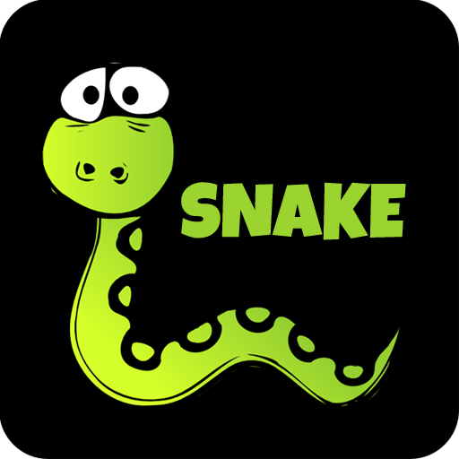
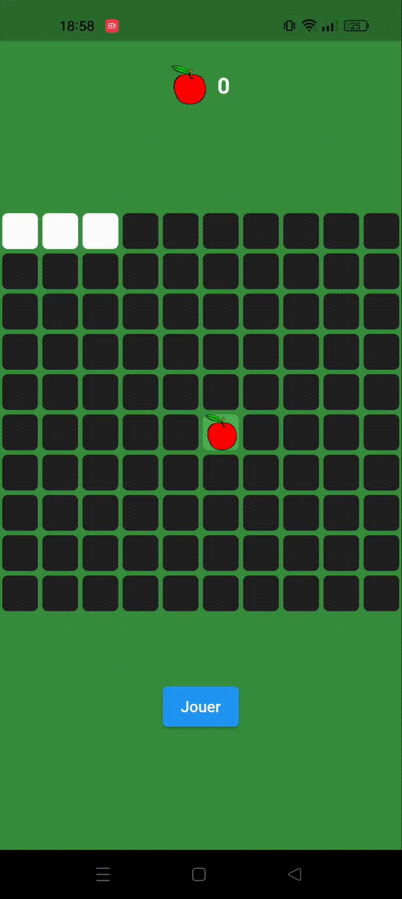
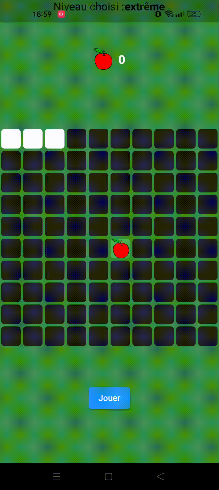
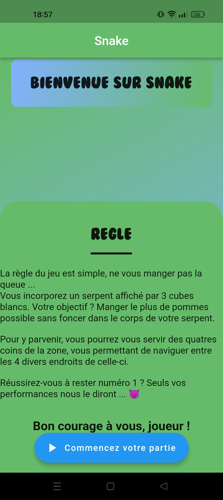
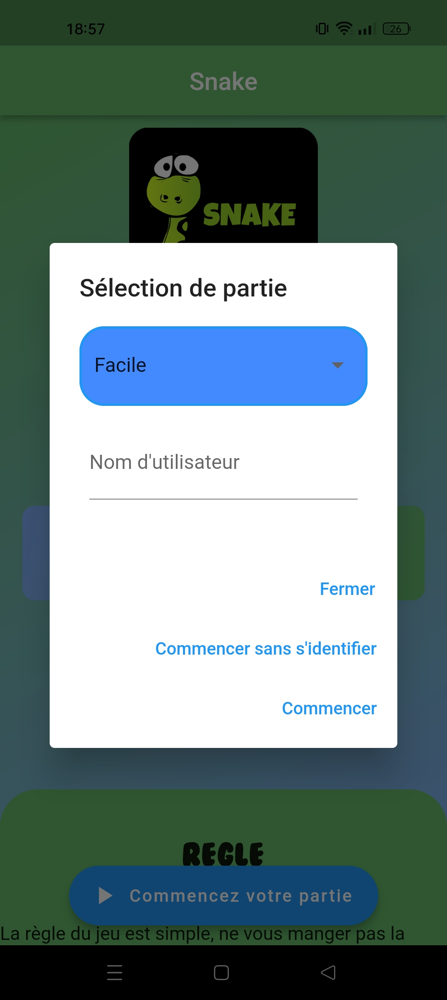
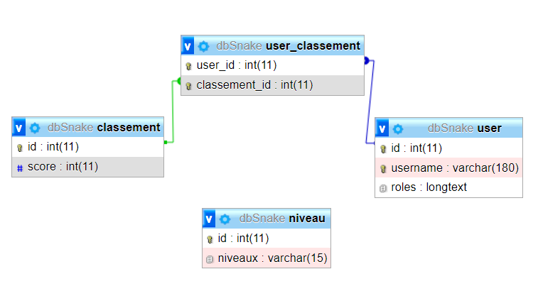

<h1 align="center">Bienvenue sur Snake</h1>

    

 
 

<h2 align="center">A propos de ce projet</h3>
Le projet <strong>Snake</strong> est un projet personnel ayant pour but de reprendre le très connu jeu Google gratuit du "Snake".
Celui-ci a été retranscrit en application mobile, développé en Flutter et Dart, en y aillant ajouté certaine fonctionnalitée tel que l'ajout de divers niveaux. Ce jeu possède diverses interfaces : l'accueil possédant la règle du jeu et les simples explications, le pop-up de login, de fin etc ... Ceux-ci ont été conçu dans un but de communication simple entre le joueur et l'application.

 
 

<h2 align="center">Interfaces du jeu</h2>
 

Ces deux interfaces montrent 2 niveaux opposés au Snake, à gauche le niveau <strong>facile</strong> soit le premier, et à droite le niveau <strong>extrême</strong> soit le dernier. Il y a un total de 4 niveaux ayant chacun leurs difficultées ainsi que leurs vitesse de jeu.
 

    
    

 

Voici désormais un rapide avant goût de l'entrée dans cette application.
 

    
    

 

<h2 align="center">Base de donnée</h2>
 

Concernant la <strong>base de donnée</strong>, le but était simplement de pouvoir s'identifier si on le souhaiter et de pouvoir envoyer ces données. Pour cela, la table <strong>user</strong> stockera logiquement le pseudonyme, la table <strong>niveau</strong> stockera le nom et le numéro de celui-ci et la table <strong>classement</strong> s'occupera des scores, ce qui permettra par la suite de générer un classement des meilleurs joueurs.
 

    

Bien évidemment, le principe du jeu du Snake n'est pas de gagner... Votre but est de faire le meilleur score possible, vous allez donc forcément perdre à un moment ou à un autre, mais à quel moment ? 😈 A votre tour ! Jusqu'où irez vous ?